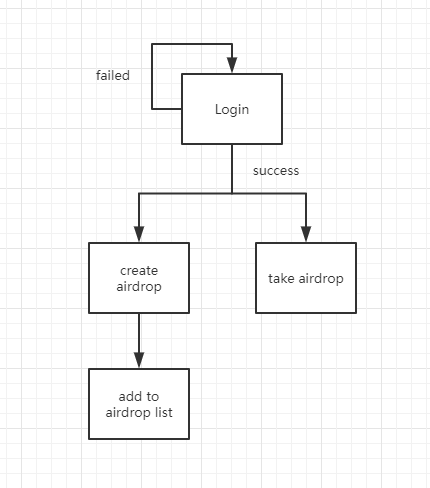

# DAirdrop
This project is base on Blockstack Course, target is dev a airdrop Dapp with Blockstack.  

Branch will follow course progress, seperate by hw(homework).  
[Deploy on netlify](https://dairdrop.netlify.com/)

Chart below is pipline to DAirdrop(On-going)  
